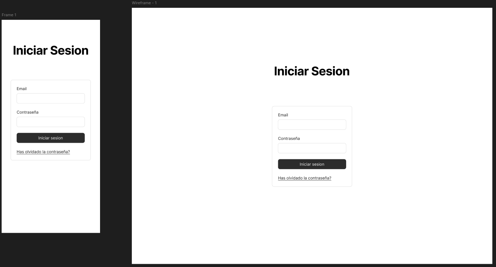
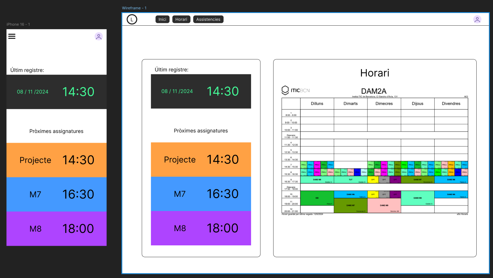
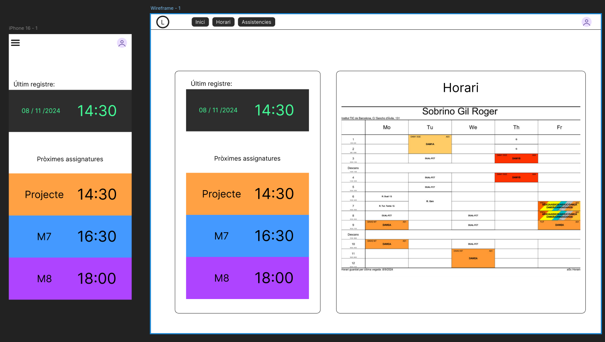
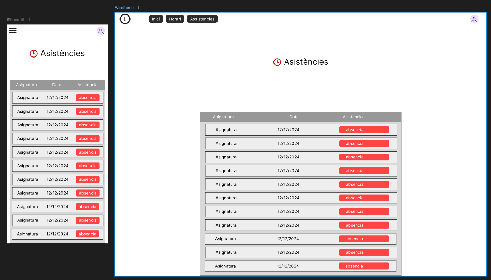
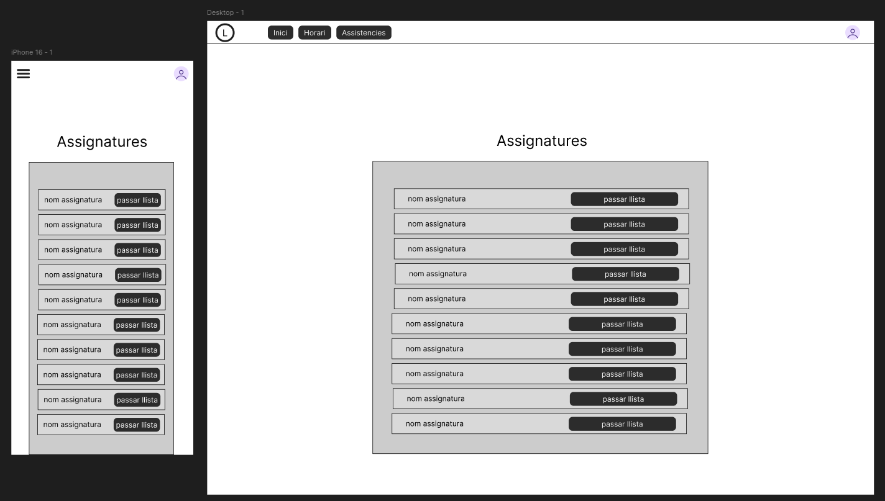
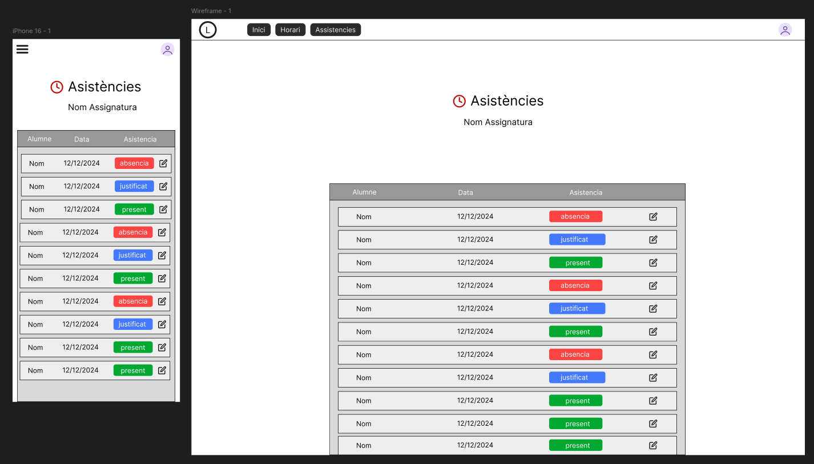
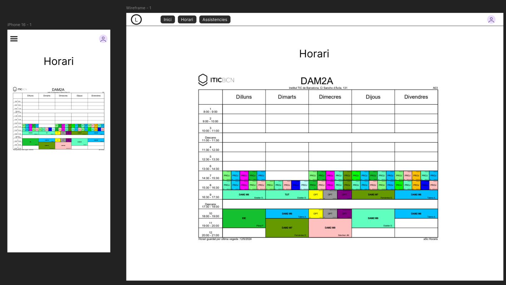
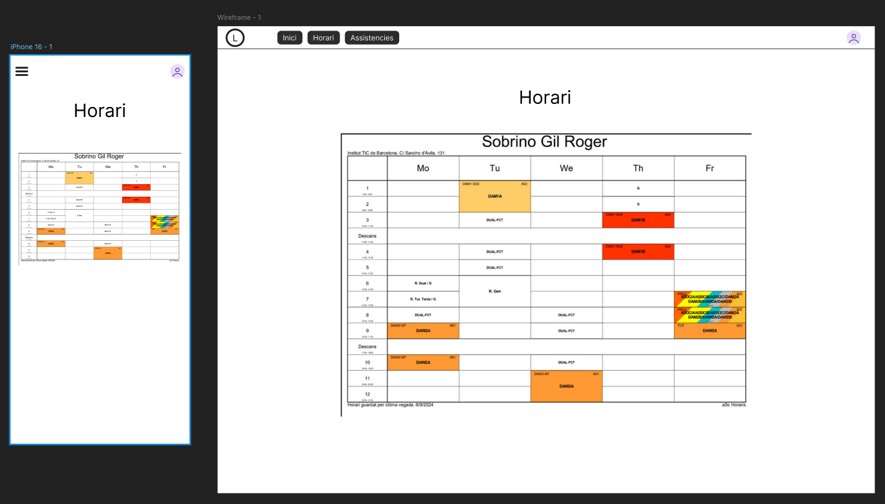

# SPRINT-1
FIGMA DANI: https://www.figma.com/design/M678nxvQeOHSssDM5pdk2F/Untitled?node-id=0-1&t=X5KhpWC9Jp7O7JaE-1

## Part DAW

[Link figma](https://www.figma.com/design/GhoUdr6eW2mQHnZMafSNAA/Untitled?node-id=0-1&node-type=canvas&t=bO3nDgOnIfGhOwH8-0)

### Login

La pàgina del login consta d'un formulari amb:
- Label per el email
- Input per el email
- Label per la contrasenya
- Botó per enviar la petició del formulari
- Link per recuperar contrasenya

### Home

#### Versió de mobil

La pàgina inicial mostra l'última vegada que es va fitxar i les proximes assignatures.

#### Versió d'ordinador

La pàgina inicial mostra l'última vegada que es va fitxar, les proximes assignatures i una grella amb l'horari.

`Versió dels alumnes:`

`Versió dels professors: `

### Asistències

#### Versió dels alumnes

Aquesta pàgina mostra una taula amb totes les assistències amb el nom de les assignatures, dates i tipus d'assistencia.

`Versió dels alumnes: `

#### Versió dels professors

La part d'asistències del professorat consta de dos parts:

- Selecció de la clase
- Asistències de la clase

##### Selecció de la clase

A aquesta pàgina es mostra una taula amb les clases disponibles del professor amb un link per pasar llista a aquesta clase.

##### Asistències de la clase

A aquesta pàgina es mostra una taula amb les asistències dels alumnes que pertanyen a la clase amb el nom, data i tipus de asistència.

### Horari

La pàgina del horari consta de una graella amb l'horari del usuari.

`Versió Alumne: `

`Versió professorat: `

## Part DAM

## 1. Login
- **Función**: Permite a los usuarios ingresar o registrarse en la aplicación.
- **Elementos Clave**:
  - Header con botones de acceso y registro.
  - Campos de usuario y contraseña.
  - Enlace para recuperar contraseña.
  - Botón de "Sign In".
  - Footer con íconos de redes sociales.
  

## 2. Dashboard
- **Función**: Presenta un resumen de actividad y acceso a las funciones principales.
- **Elementos Clave**:
  - Header con logo.
  - Barra de búsqueda para buscar empleados.
  - Tarjetas informativas (entradas, salidas, activos).
  - Botones de acceso rápido: Registro, Historial y Perfil.
  - Footer de navegación.
  

## 3. Registro
- **Función**: Página para registrar entrada o salida del usuario.
- **Elementos Clave**:
  - Header con logo.
  - Dos botones grandes: "Fichar Entrada" y "Fichar Salida".
  - Footer con navegación y redes sociales.
  

## 4. Historial
- **Función**: Visualizar y filtrar el historial de entradas y salidas.
- **Elementos Clave**:
  - Header con logo.
  - Calendario para seleccionar fechas.
  - Input de fecha para filtro manual.
  - Botones "Cancelar" y "OK".
  - Footer de navegación.
  
## 5. Perfil
- **Función**: Mostrar y editar la información personal del usuario.
- **Elementos Clave**:
  - Header con logo.
  - Tarjetas para datos personales: Nombre, ID, Contraseña, Fecha de Nacimiento.
  - Footer de navegación y redes sociales.
  
